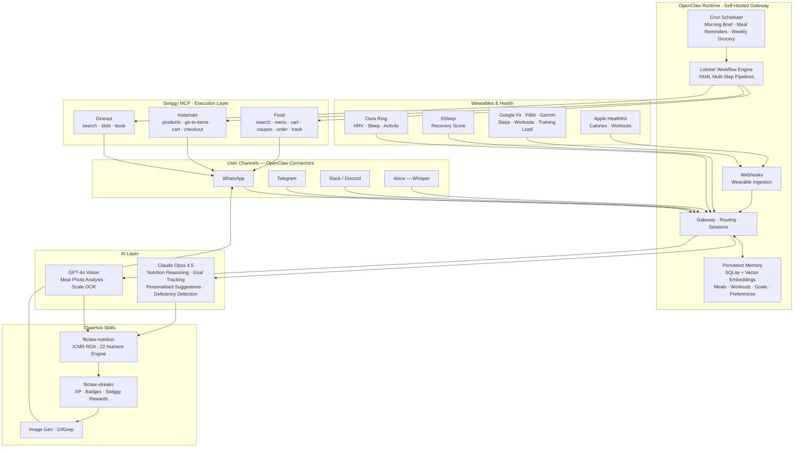

  

<h1 align="center">FitClaw</h1>

Your 24/7 AI fitness & nutrition coach — personalised, persistent, and fully autonomous.

Powered by <strong>OpenClaw</strong> · Executed by <strong>Swiggy MCP</strong> · Lives in <strong>WhatsApp & Telegram</strong>

  
  
  
  

---

## What is FitClaw?

FitClaw is your **personal fitness and nutrition coach** — available 24/7 on WhatsApp and Telegram, with no app to download and no menus to navigate.

It **remembers everything**: every meal you've eaten, every workout you've logged, your calorie history, your goals, your budget, your preferred foods, and your schedule. Every suggestion it makes is built on that complete picture of *you* — not a generic plan.

When your nutrition is off, it doesn't just tell you what to eat. It **places the order through Swiggy**. You confirm with one message. Done.

> Think of it as having a nutritionist, a personal trainer, a meal planner, and a food delivery concierge — all in one chat thread, always on, always personalised.

---

## Core Experience

| | |
|---|---|
| 🧠 **Remembers you** | Every meal, workout, goal, preference and habit stored in persistent memory. Every response is personal to you. |
| 🛒 **Orders for you** | Detects what your body needs, finds the right meal on Swiggy, and places the order — straight from your WhatsApp chat. No app, no browsing. |
| ⏰ **Notifies you** | Meal time reminders, hydration nudges, workout alerts, and supplement windows — all sent proactively based on your schedule. |
| 🎯 **Tracks your goals** | Set weight loss, muscle gain, or maintenance targets. FitClaw adjusts your daily calorie and macro budget automatically as you progress. |
| 🏋️ **Logs your workouts** | Log sessions by text or voice. FitClaw factors your burn into the day's nutrition plan and adjusts meal suggestions accordingly. |
| 🗓️ **Schedules everything** | Meal times, workout windows, rest days, grocery restocking — all scheduled and managed without you having to think about it. |
| 🎙️ **Voice support** | Talk to FitClaw hands-free via OpenClaw's built-in voice connector. Log meals, ask questions, place orders — all by voice. |
| 💸 **Budget-aware** | Set a weekly food budget. FitClaw factors cost into every Swiggy recommendation and automatically applies the best available coupon. |

---

## Features

### 🧬 Persistent Memory & Personalisation
- Full history of meals, workouts, weight, goals, and preferences retained across every conversation
- Learns your favourite foods, go-to restaurants, and dietary restrictions over time
- Every suggestion, reminder, and order is generated from *your* data — never generic defaults

### 📸 Meal Tracking — Just Send a Photo
- Photograph any meal and send it on WhatsApp or Telegram
- GPT-4o Vision identifies dishes, estimates portions, and logs macros automatically
- Responds within seconds with calorie and nutrient breakdown
- Supports restaurant plates, home meals, and packaged food labels

### 🔔 Proactive Meal & Workout Notifications
- Morning brief: today's calorie budget, macro targets, and scheduled meals
- Meal time reminders based on your personal eating schedule
- Post-workout nutrition window alerts triggered by wearable data
- Evening summary: what you hit, what you missed, what's needed tomorrow

### 🎯 Goal Tracking
- Set and update goals: weight loss, muscle gain, body recomposition, or maintenance
- Weekly progress reports with trend analysis
- Macro and calorie targets auto-recalibrate as your weight and activity level change
- Milestone celebrations with Swiggy reward coupons

### 🏋️ Workout Logging & Calorie Adjustment
- Log workouts by text (`"45 min run"`) or voice
- Syncs automatically from Oura Ring, 8Sleep, Google Fit, Fitbit, Garmin, and Apple HealthKit
- Calorie burn factored into the day's remaining budget in real time
- Rest day vs. training day menus adjusted automatically

### 🛒 Order Directly from Chat — No App Required
- FitClaw finds the right meal for your current macro gap, sends options to WhatsApp
- Reply `"order"` or `"yes"` — order placed, coupon applied, delivery tracked
- No opening Swiggy, no scrolling menus, no decision fatigue
- Budget filtered: only shows options within your set spend limit
- Delivery ETA sent back to chat automatically

### 🧺 Weekly Grocery Autopilot via Instamart
- Every Sunday, FitClaw generates a grocery list based on your week's nutrition gaps
- Sends the list to WhatsApp for one-tap approval
- Orders from Instamart and learns your preferred brands over time
- Covers proteins, vegetables, supplements, and pantry staples

### 🍽️ Dineout — Smart Restaurant Booking
- Suggests restaurants with menus that fit your macro budget
- Books a free table reservation via Dineout MCP — directly from chat

### 🔬 Nutrition Deficiency Detection
- Tracks 22 nutrients against ICMR Recommended Dietary Allowances
- Rolling 7-day analysis surfaces deficiencies before symptoms appear
- Automatically sources corrections via Swiggy or Instamart

| Deficiency | FitClaw Action |
|---|---|
| Low Protein | Orders high-protein meal from nearest restaurant |
| Low Iron | Searches palak paneer / rajma on Swiggy Food |
| Low Vitamin B12 | Adds fortified curd / milk to Instamart cart |
| Low Fiber | Adds oats, dal, fruits to weekly grocery order |
| Low Omega-3 | Suggests flaxseed / fish options via Swiggy |

### ⚖️ Weight Tracking via Scale OCR
- Photograph any weighing scale — analog or digital — and weight is logged automatically
- Weekly trend graph and projection toward goal sent every Sunday
- Macro targets recalibrate based on progress

### 🎙️ Voice Support
- Full voice interaction via OpenClaw's native Voice connector (Whisper STT)
- Log meals, ask for nutrition breakdowns, confirm orders, set reminders — all by speaking
- Works hands-free on iOS and Android via OpenClaw companion apps

### 🏆 Coach Personality Modes
Switch modes anytime by messaging FitClaw directly.

| Mode | Style |
|---|---|
| `BEAST` | Aggressive targets, auto-orders, no excuses |
| `ZEN` | Gentle nudges, recovery-aware, mindful |
| `BIO` | Micronutrient-first, lab-grade weekly reports |
| `GAME` | XP, streaks, badges, leaderboard, challenges |
| `FOODIE` | Cuisine exploration within macro and budget limits |

### 🏅 Streaks & Rewards
- Daily streak tracking for consistent logging and goal adherence
- Swiggy coupon rewards unlocked at milestones (₹50 at 7 days · ₹200 at 30 days)
- Shareable streak cards generated automatically via OpenClaw Image Gen

---

## Connectors

### Messaging

  
  
  
  
  

### AI Models

  
  

### Swiggy MCP

  
  
  

### Wearables & Health

  
  
  
  
  
  

### Scheduling & Productivity

  
  
  
  

### Voice & Media

  
  
  

---

## Architecture

---

## Swiggy MCP Tools

| Server | Tools |
|---|---|
| **Food** | `search_restaurants` `search_menu` `get_restaurant_menu` `update_food_cart` `fetch_food_coupons` `apply_food_coupon` `place_food_order` `track_food_order` |
| **Instamart** | `search_products` `your_go_to_items` `update_cart` `checkout` `get_orders` |
| **Dineout** | `search_restaurants_dineout` `get_available_slots` `book_table` `get_booking_status` |

---

## Tech Stack

| Component | Technology |
|---|---|
| Agent Runtime | [OpenClaw](https://openclaw.ai) — self-hosted, MIT licensed |
| AI Reasoning | Claude Opus 4.5 (Anthropic) |
| Vision & OCR | GPT-4o Vision (OpenAI) |
| Food & Grocery Execution | Swiggy MCP — Food · Instamart · Dineout |
| Workflow Orchestration | Lobster — OpenClaw YAML pipeline engine |
| Skill Registry | [ClawHub](https://clawhub.ai) |
| Messaging | WhatsApp (Baileys) · Telegram · Slack · Discord · Signal |
| Voice | OpenClaw Voice skill — Whisper STT |
| Persistent Memory | SQLite + local vector embeddings |
| Scheduling | OpenClaw Cron |
| Wearables | Oura Ring · 8Sleep · REST webhooks |
| Language | TypeScript · Node.js 24 |

---

## Roadmap

| Phase | Milestone | Status |
|---|---|---|
| **1** | WhatsApp/Telegram chat · Meal photo logging · Scale OCR · Swiggy Food ordering · Goal tracking · 5 coach modes · Streaks | 🔨 Building |
| **2** | Instamart weekly autopilot · Dineout booking · Oura + 8Sleep · `fitclaw-nutrition` ClawHub skill · Voice mode | 📋 Planned |
| **3** | Google Fit · Fitbit · Garmin · Apple HealthKit · Google Calendar sync · Budget mode | 📋 Planned |
| **4** | Tata 1mg blood test integration · Hindi / regional language support · B2B corporate wellness | 🔮 Future |

---

  Built on <a href="https://openclaw.ai">OpenClaw</a> ·
  Powered by <a href="https://mcp.swiggy.com/builders">Swiggy Builders Club</a>

